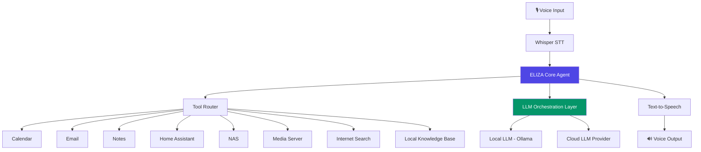

<div align="center">
<pre>
EEEEEEE  LL       IIIIII  ZZZZZZZ   AAAAA 
EE       LL         II        ZZ   AA   AA
EEEEE    LL         II      ZZZ    AAAAAAA
EE       LL         II     ZZ      AA   AA
EEEEEEE  LLLLLLL  IIIIII  ZZZZZZZ  AA   AA
</pre>

</div>

# ELIZA — Personal AI Operating System

> A private, self-hosted, voice-first AI assistant that understands, remembers, reasons, and acts across your digital and physical environment.

Named after ELIZA, the world's first chatbot (1966), and inspired by JARVIS from *Iron Man*, this project aims to grow from a conversational assistant into a full personal AI operating system — the unified intelligence layer for your home, devices, and digital life.

[](LICENSE)
[](docs/ROADMAP.md)
[](https://www.python.org/)

---

## Table of Contents

- [Overview](#overview)
- [Features](#features)
- [Architecture](#architecture)
- [Installation](#installation)
- [Quick Start](#quick-start)
- [Development Setup](#development-setup)
- [Documentation](#documentation)
- [Roadmap](#roadmap)
- [Contributing](#contributing)
- [License](#license)

---

## Overview

ELIZA is not a chatbot wrapper — it is an extensible **agentic platform** that serves as a central intelligence layer for personal infrastructure. It listens, reasons, remembers, and acts through a modular tool system, running entirely on hardware you control.

**Design principles:**

| Principle | Meaning |
|---|---|
| Privacy First | Your data, your keys, your logs — never leaves your network unless you explicitly allow it |
| Self-Hosted | Runs on your own homelab hardware, no mandatory cloud dependency |
| Open Source | Built on and contributing back to the open-source AI ecosystem |
| Local First | Local models and local data are the default; cloud is opt-in augmentation |
| Modular | Every capability is a swappable, independently testable component |
| Production-Ready | Built with the engineering rigor of production systems, not a weekend hack |
| Scalable | Designed to grow from a single Raspberry Pi to a multi-node homelab cluster |
| Extensible | New tools, agents, and integrations plug in without touching the core |
| Human-in-the-Loop | High-stakes actions require confirmation; ELIZA never acts unilaterally on irreversible operations |

---

## Features

### Available Today (Phase 1)
- 🎙️ Voice input via local Whisper transcription
- 💬 Text-based conversational core agent
- 🧠 Short-term conversational memory
- 🔧 Tool-calling via a modular tool router
- 📅 Calendar read/query integration
- 🗒️ Notes read/query integration
- 🐳 Full Docker Compose deployment

### Planned
- 📧 Email triage and drafting
- 🏠 Home Assistant device control
- 🔍 Local knowledge base with RAG (semantic search over your documents)
- 🔊 Full voice round-trip (wake word → STT → agent → TTS)
- 🗂️ NAS and media server integration
- 🌐 Internet research agent
- 🤖 Multi-agent orchestration (planner, researcher, memory, home, tool agents)
- 📊 Full observability via Langfuse + MLflow
- 🔌 MCP-based integration ecosystem

See [docs/ROADMAP.md](docs/ROADMAP.md) for the full phased plan.

---

## Architecture



For the full system architecture, component responsibilities, and sequence diagrams, see [docs/ARCHITECTURE.md](docs/ARCHITECTURE.md).

---

## Installation

### Prerequisites

- Docker & Docker Compose v2+
- Python 3.11+
- 16GB+ RAM recommended (32GB+ if running local LLMs)
- NVIDIA GPU optional but recommended for local LLM/Whisper inference
- Linux host recommended (tested on Ubuntu 24.04)

### Clone the repository

```bash
git clone https://github.com/PrabhakaranVijay/ELIZA.git
cd ELIZA
```

### Configure environment

```bash
cp .env.example .env
# Edit .env with your configuration:
# - LLM provider keys (optional, for cloud fallback)
# - Database credentials
# - Home Assistant token (optional)
```

### Launch with Docker Compose

```bash
docker compose up -d
```

This starts:
- `eliza-core` — the FastAPI agent core
- `postgres` — structured data store
- `qdrant` — vector database
- `ollama` — local LLM runtime
- `langfuse` — observability dashboard

---

## Quick Start

Once running, interact with ELIZA via the REST API or CLI:

```bash
# Text query via CLI
python -m eliza.cli chat "What's on my calendar today?"

# Or via REST API
curl -X POST http://localhost:8000/api/v1/chat \
  -H "Content-Type: application/json" \
  -d '{"message": "What'\''s on my calendar today?"}'
```

Check system health:

```bash
curl http://localhost:8000/api/v1/health
```

Access the Langfuse observability dashboard at `http://localhost:3000`.

---

## Development Setup

```bash
# Create virtual environment
python -m venv .venv
source .venv/bin/activate

# Install dependencies (including dev tools)
pip install -e ".[dev]"

# Run database migrations
alembic upgrade head

# Run the dev server with hot reload
uvicorn eliza.main:app --reload --port 8000

# Run tests
pytest

# Run linting and type checks
ruff check .
mypy eliza/
```

See [CONTRIBUTING.md](CONTRIBUTING.md) for the full development workflow, branching strategy, and PR process.

---

## Documentation

| Document | Description |
|---|---|
| [docs/VISION.md](docs/VISION.md) | Mission, philosophy, and long-term goals |
| [docs/ARCHITECTURE.md](docs/ARCHITECTURE.md) | System design and component architecture |
| [docs/ROADMAP.md](docs/ROADMAP.md) | Phased development plan |
| [docs/REQUIREMENTS.md](docs/REQUIREMENTS.md) | Functional and non-functional requirements |
| [docs/DECISIONS.md](docs/DECISIONS.md) | Architecture Decision Records |
| [docs/AGENTS.md](docs/AGENTS.md) | Agent roles and communication patterns |
| [docs/MEMORY.md](docs/MEMORY.md) | Memory architecture (short-term, long-term, knowledge base) |
| [docs/SECURITY.md](docs/SECURITY.md) | Security model and threat analysis |
| [docs/DEPLOYMENT.md](docs/DEPLOYMENT.md) | Deployment guides for all environments |
| [CONTRIBUTING.md](CONTRIBUTING.md) | How to contribute |

---

## Roadmap

| Phase | Focus | Status |
|---|---|---|
| **Phase 1** | MVP — Core agent, text chat, basic tools | 🚧 In Progress |
| **Phase 2** | Personal Assistant — Voice, memory, calendar/email | ⬜ Planned |
| **Phase 3** | Home Intelligence — Home Assistant, NAS, media | ⬜ Planned |
| **Phase 4** | Agent Ecosystem — Multi-agent orchestration, MCP | ⬜ Planned |
| **Phase 5** | AI Operating System — Full autonomy, plugin ecosystem | ⬜ Future |

Full details in [docs/ROADMAP.md](docs/ROADMAP.md).

---

## Contributing

Contributions are welcome, whether you're fixing a bug, adding a tool integration, or improving documentation. Please read [CONTRIBUTING.md](CONTRIBUTING.md) before opening a PR.

This is currently a personal infrastructure project evolving toward a general-purpose open-source platform — expect the architecture to shift as it matures. Design discussions happen in [docs/DECISIONS.md](docs/DECISIONS.md).

---

## License

Licensed under the [MIT License](LICENSE).

---

## Acknowledgments

- **ELIZA (1966)** by Joseph Weizenbaum — the original chatbot, and namesake of this project
- The open-source AI ecosystem: Whisper, Ollama, LangGraph, Qdrant, Home Assistant, and countless others this project stands on
