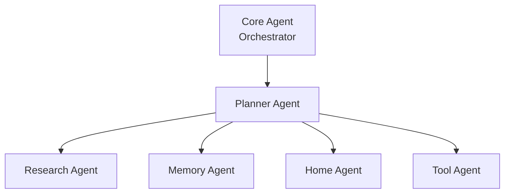

# ELIZA — Agent Architecture

This document defines the agents that make up ELIZA's reasoning layer, their responsibilities, and how they communicate. In Phase 1–3, most of these roles are implemented as functions/subgraphs within a single Core Agent process. Phase 4 formalizes them into independently deployable services.

## Overview



---

## Core Agent (Orchestrator)

**Responsibility:** The entry point for all user requests. Owns the conversation session, assembles context, delegates to the Planner, and formats the final response.

- Receives input from the API gateway (text or transcribed voice)
- Loads session state and short-term memory
- Invokes the Planner Agent to determine a course of action
- Aggregates results from sub-agents into a coherent final response
- Persists the conversation turn
- Emits tracing spans to Langfuse for the full request lifecycle

**Does not:** directly call external tools, decide *how* to fulfill a request beyond delegation — that logic lives in the Planner.

---

## Planner Agent

**Responsibility:** Decompose a user request into a sequence of steps and route each step to the appropriate specialized agent.

- Classifies intent (direct answer vs. needs research vs. needs memory vs. needs home action vs. needs external tool)
- For multi-step requests, produces an ordered plan (e.g., "check calendar, then draft email referencing the meeting time")
- Re-plans if a step fails or returns unexpected results
- Enforces the human-in-the-loop policy: flags any step requiring confirmation before execution

**Communication pattern:** Receives a request + context from the Orchestrator, returns either a direct response or a plan (list of steps with target agent + parameters).

---

## Research Agent

**Responsibility:** Answer questions requiring information gathering beyond what's in memory — internet search, multi-source synthesis.

- Performs web search queries
- Fetches and summarizes page content
- Synthesizes multi-source answers with source attribution
- Escalates to cloud LLM when task complexity warrants it (per LLM Gateway policy)

**Communication pattern:** Receives a research question, returns a synthesized answer with sources. Stateless between invocations — does not itself manage memory persistence.

---

## Memory Agent

**Responsibility:** Owns all reads and writes to short-term and long-term memory (see [MEMORY.md](MEMORY.md) for the full memory model).

- Retrieves relevant long-term memory (facts + semantic search) for a given query
- Writes new facts stated by the user to persistent storage
- Manages memory conflict resolution (e.g., updated preferences superseding old ones)
- Handles user-initiated memory review/deletion requests

**Communication pattern:** Called by the Orchestrator at context-assembly time (read) and after a turn completes (write). Also callable directly by the Planner when a request is explicitly about memory ("what do you remember about my allergies?").

---

## Home Agent

**Responsibility:** Interfaces with the physical environment — Home Assistant, NAS, media server.

- Queries device/service state
- Executes control actions (subject to human-in-the-loop policy for irreversible actions)
- Maintains a cached view of home state to reduce redundant polling

**Communication pattern:** Receives a structured action request (device/service + operation + parameters) from the Planner, returns success/failure + resulting state.

---

## Tool Agent

**Responsibility:** General-purpose executor for integrations that don't fall under Home Agent — calendar, email, notes, and any future MCP-based tool.

- Maintains the registry of available tools/MCP servers
- Validates tool call parameters against tool schemas before execution
- Executes the call and normalizes the result format back to the Planner
- Surfaces tool errors in a way the Planner can reason about (retry vs. abandon vs. ask user)

**Communication pattern:** Receives a tool name + parameters from the Planner, returns a normalized result or error.

---

## Responsibilities Summary

| Agent | Reads Memory | Writes Memory | Calls External Systems | Requires Confirmation For |
|---|---|---|---|---|
| Core Agent (Orchestrator) | Yes (session) | Yes (session) | No (delegates) | N/A |
| Planner | Yes (via Memory Agent) | No | No (delegates) | Determines which steps need it |
| Research | No | No | Yes (web search) | Never (read-only) |
| Memory | Yes | Yes | No | Bulk deletion of memory |
| Home | Yes (cached state) | Yes (cached state) | Yes (Home Assistant, NAS, media) | Locks, security devices, irreversible actions |
| Tool | No | No | Yes (calendar, email, MCP tools) | Sending email, calendar writes, any external-facing action |

---

## Communication Patterns

### Message Schema (Phase 4+)

Once agents are independent services, they communicate via a structured message envelope:

```json
{
  "trace_id": "uuid",
  "from_agent": "planner",
  "to_agent": "tool",
  "action": "execute_tool",
  "payload": {
    "tool_name": "calendar.create_event",
    "parameters": { "title": "Dentist", "start": "2026-09-01T10:00:00Z" }
  },
  "requires_confirmation": true
}
```

### Synchronous vs. Asynchronous

- **Synchronous (request/response):** Used for most in-conversation agent calls where the user is waiting (Planner → Tool Agent for a quick lookup).
- **Asynchronous (queued):** Used for longer-running tasks (Research Agent performing multi-step web research, Home Agent waiting on a device state change) — the Orchestrator can inform the user a task is in progress and follow up when complete.

### Failure Handling

Every agent returns a standardized error shape rather than raising unhandled exceptions across the agent boundary, so the Planner can make informed re-planning decisions (retry, try an alternative agent/tool, or surface the failure to the user honestly rather than hallucinating a result).

```json
{
  "status": "error",
  "agent": "tool",
  "error_type": "integration_unavailable",
  "message": "Home Assistant connection timed out",
  "retryable": true
}
```
