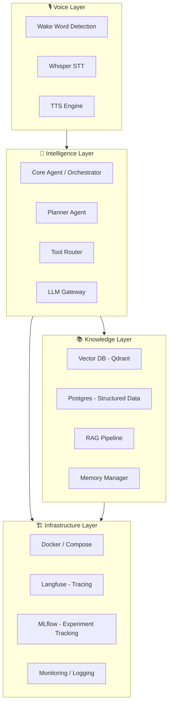
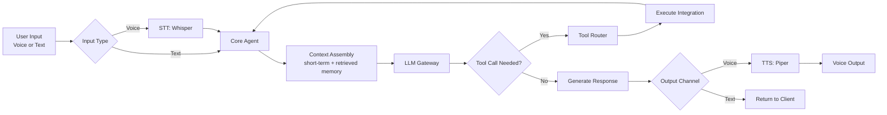
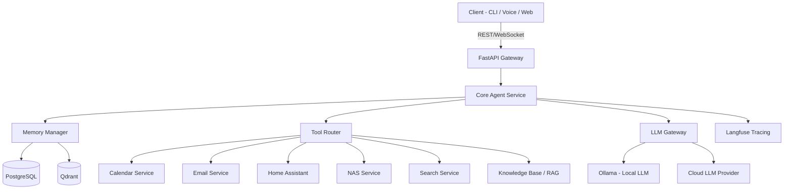
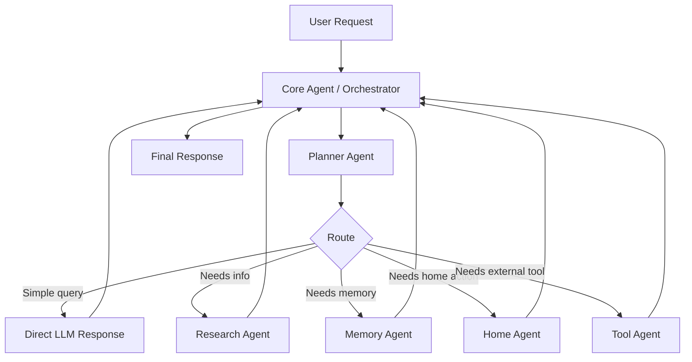
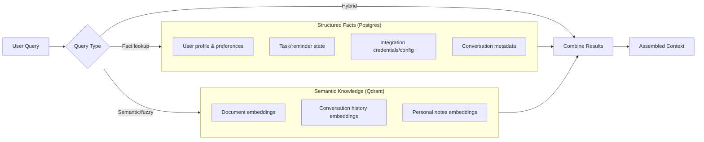
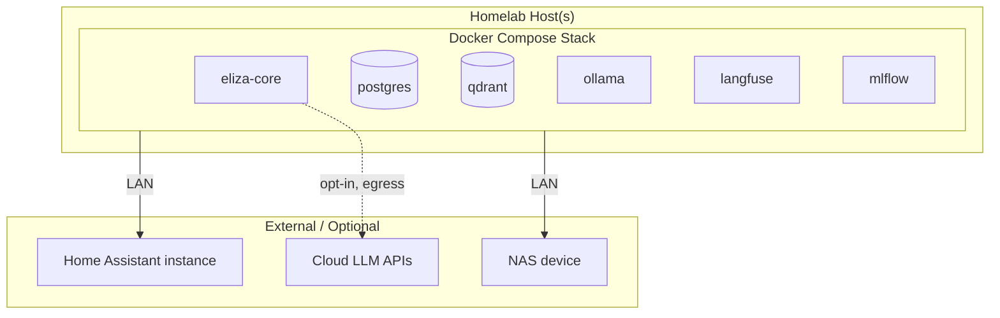
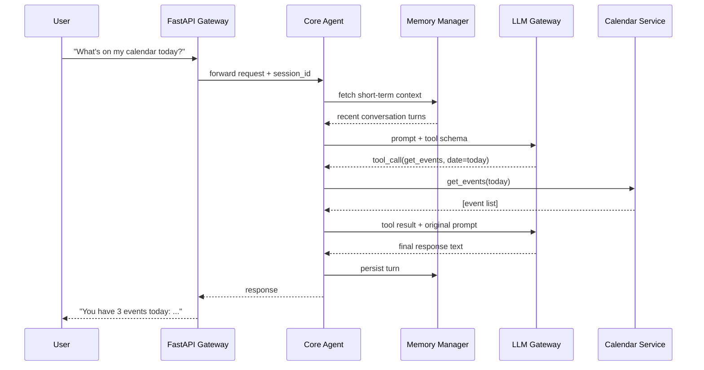
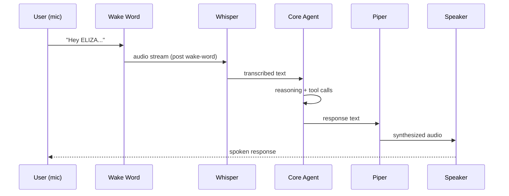
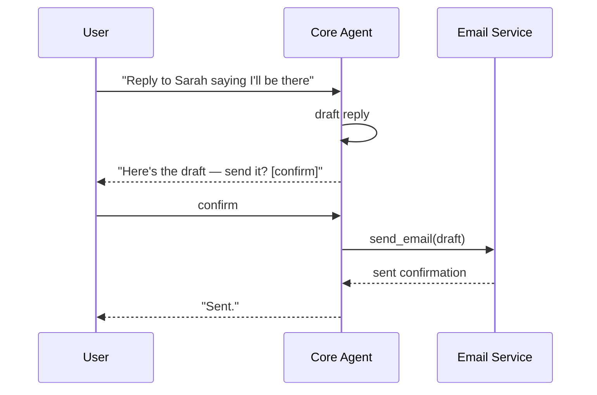

# ELIZA — Architecture

## Table of Contents
- [High-Level Architecture](#high-level-architecture)
- [System Components](#system-components)
- [Data Flow](#data-flow)
- [Service Interactions](#service-interactions)
- [Agent Architecture](#agent-architecture)
- [Knowledge Architecture](#knowledge-architecture)
- [Infrastructure Architecture](#infrastructure-architecture)
- [Sequence Diagrams](#sequence-diagrams)

---

## High-Level Architecture

ELIZA is organized into four layers, each independently deployable and testable:

Each layer communicates through well-defined interfaces (REST/gRPC internally, MCP for external tool integrations), so any layer's implementation can be replaced without affecting the others.

---

## System Components

| Component | Responsibility | Primary Tech |
|---|---|---|
| **Voice Gateway** | Wake word detection, audio capture, streaming to STT | openWakeWord, PyAudio |
| **STT Service** | Converts speech to text | faster-whisper |
| **Core Agent** | Central reasoning loop; receives input, decides on tool use vs. direct response | LangGraph, FastAPI |
| **Tool Router** | Maps agent intents to concrete tool/integration calls | Custom + MCP client |
| **LLM Gateway** | Routes requests to local or cloud LLM based on task, cost, and privacy policy | Ollama, Anthropic/OpenAI SDKs |
| **Memory Manager** | Reads/writes short-term and long-term memory | Postgres + Qdrant |
| **RAG Pipeline** | Ingests documents, chunks, embeds, retrieves relevant context | LlamaIndex + Qdrant |
| **Integration Services** | Calendar, email, notes, Home Assistant, NAS, media server clients | REST/MCP clients |
| **TTS Service** | Converts response text to speech | Piper |
| **Observability Stack** | Tracing, metrics, evaluation | Langfuse, MLflow, Prometheus/Grafana |

---

## Data Flow

---

## Service Interactions

All internal services expose a health check endpoint (`/health`) and structured JSON logs. Cross-service calls carry a trace ID propagated to Langfuse for end-to-end observability.

---

## Agent Architecture

ELIZA's reasoning layer is built as a directed graph of specialized agents coordinated by a central orchestrator (see [docs/AGENTS.md](AGENTS.md) for full detail on each agent's responsibilities).

In Phase 1, the "Planner" and "Orchestrator" are the same process with a simple rules + LLM router. Full multi-agent separation (Phase 4) introduces independent, testable agent processes communicating over a defined message schema.

---

## Knowledge Architecture

Knowledge is deliberately split across two stores rather than unified into a single vector database:

This separation exists because facts ("what's my WiFi password," "when is my dentist appointment") need deterministic, exact retrieval — a vector search is the wrong tool. Semantic knowledge ("what did I say about that book last month") is exactly what embeddings are good at. Full rationale in [docs/MEMORY.md](MEMORY.md).

---

## Infrastructure Architecture

Phase 1–3 target a single Docker Compose host. Phase 5 introduces optional Kubernetes support for multi-node homelab clusters — see [docs/DEPLOYMENT.md](DEPLOYMENT.md).

---

## Sequence Diagrams

### Text query with tool use

### Voice round-trip (Phase 2+)

### Human-in-the-loop confirmation

---

## Design Trade-offs

| Decision | Trade-off Accepted |
|---|---|
| Postgres + Qdrant split | Extra operational complexity vs. correctness of fact retrieval |
| Local-first LLM | Lower ceiling on reasoning quality vs. privacy and cost control |
| LangGraph over autonomous agent frameworks | Less "magic"/autonomy vs. far greater debuggability |
| Docker Compose before Kubernetes | Slower path to multi-node scale vs. avoiding premature complexity |
| MCP as the integration standard | Dependency on an evolving spec vs. avoiding a bespoke protocol that would need rebuilding later |

See [docs/DECISIONS.md](DECISIONS.md) for the full Architecture Decision Record log.
