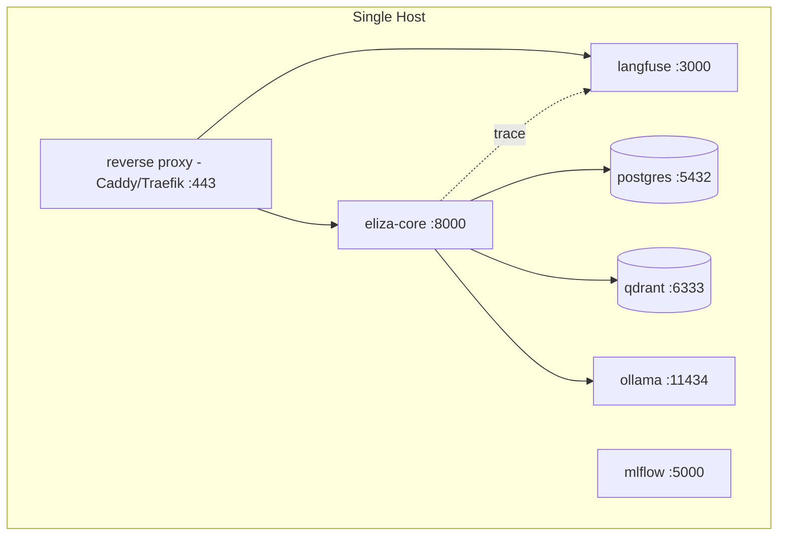
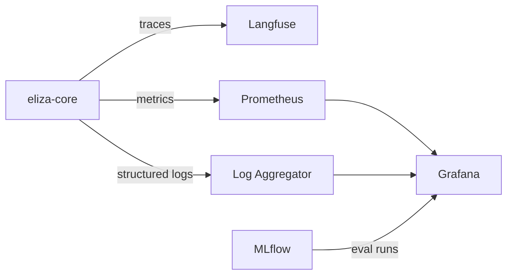

# ELIZA — Deployment

## Local Deployment

For development or single-user testing without full containerization:

```bash
# Start dependent services only (db, vector store, ollama)
docker compose up -d postgres qdrant ollama

# Run the core service locally for fast iteration
source .venv/bin/activate
uvicorn eliza.main:app --reload --port 8000
```

Useful for rapid iteration on agent logic without rebuilding containers on every change.

---

## Docker Deployment

The standard deployment target for Phase 1–3 is a single-host Docker Compose stack.



**`docker-compose.yml` service overview:**

| Service | Purpose | Persisted Volume |
|---|---|---|
| `eliza-core` | FastAPI agent service | — |
| `postgres` | Structured data | `pg-data` |
| `qdrant` | Vector storage | `qdrant-data` |
| `ollama` | Local LLM inference | `ollama-models` |
| `langfuse` | Tracing/observability UI | `langfuse-data` |
| `mlflow` | Experiment/eval tracking | `mlflow-data` |

```bash
docker compose up -d          # start everything
docker compose logs -f eliza-core   # tail core service logs
docker compose down           # stop (data persists in volumes)
docker compose down -v        # stop and wipe all data — use with care
```

**GPU support** (for local Whisper/LLM inference): ensure the NVIDIA Container Toolkit is installed and add the appropriate `deploy.resources.reservations.devices` block to the `ollama` service in `docker-compose.yml`.

---

## Homelab Deployment

Recommendations for running ELIZA as a persistent homelab service:

- **Reverse proxy + TLS:** Put Caddy or Traefik in front of any endpoint exposed beyond localhost, even on the LAN — internal traffic sniffing is still a risk on shared home networks.
- **Backups:** Schedule regular backups of the `pg-data` and `qdrant-data` volumes (e.g., via `pg_dump` + Qdrant snapshot API on a cron schedule) to separate storage (NAS or off-site).
- **Resource allocation:** Local LLM inference is the heaviest resource consumer — dedicate a GPU or reserve sufficient CPU/RAM headroom if running CPU-only inference (expect materially higher latency).
- **Network segmentation:** Consider placing ELIZA and its dependent services on a dedicated VLAN, with explicit firewall rules for what it can reach (Home Assistant, NAS) rather than flat access to the whole home network.
- **Service supervision:** Use `restart: unless-stopped` (already set in the reference Compose file) so services recover automatically after host reboots or crashes.
- **Update strategy:** Pin image versions in `docker-compose.yml` rather than tracking `latest`; update deliberately and test in a staging profile before promoting.

---

## Future Kubernetes Deployment (Phase 5)

Kubernetes is explicitly deferred until multi-node scale is actually needed (see [DECISIONS.md](DECISIONS.md) and [ROADMAP.md](ROADMAP.md) Phase 5). When that time comes:

- Stateless services (`eliza-core`, individual agent services post-Phase-4) become Deployments with HorizontalPodAutoscaler
- Stateful services (`postgres`, `qdrant`) use StatefulSets with persistent volume claims, or are migrated to managed/clustered variants (e.g., Postgres via CloudNativePG, Qdrant's clustering mode)
- Ollama inference nodes can be scheduled onto GPU-labeled nodes specifically
- A Helm chart will be maintained as the primary deployment artifact, with the Compose file retained for lightweight/single-node use

This is intentionally not built until Phase 4/5 — premature Kubernetes adoption for a single-user homelab system adds operational burden without corresponding benefit.

---

## Monitoring and Observability



- **Tracing:** Every request is traced end-to-end in **Langfuse** (`http://localhost:3000`), capturing latency per step, tool calls made, tokens consumed, and cost per request (for cloud LLM calls).
- **Experiment/eval tracking:** **MLflow** tracks agent evaluation runs — regression testing against a fixed benchmark set of tasks as the agent logic evolves (formalized in Phase 4).
- **Metrics:** Core service exposes a `/metrics` endpoint (Prometheus format) covering request latency, error rates, tool call success/failure rates, and queue depth for async tasks.
- **Logs:** Structured JSON logs from all services, aggregated (e.g., via Loki or a simple `docker compose logs` workflow for smaller deployments) and correlated by `trace_id`.
- **Alerting:** For homelab deployments, lightweight alerting (e.g., Grafana alert rules → notification to phone/email) is recommended for: service downtime, disk space on volumes, and elevated error rates.
- **Health checks:** Every service exposes `/health`; Docker Compose `healthcheck` blocks gate dependent service startup order.
