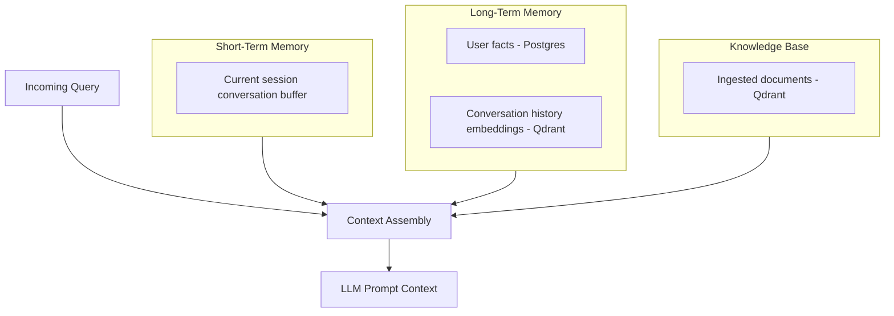
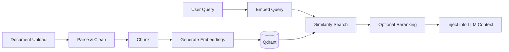

# ELIZA — Memory Architecture

Memory is one of the hardest and most important parts of ELIZA. This document defines what kinds of memory exist, where each lives, and how context gets assembled for a given request.

## Overview

---

## Short-Term Memory

**What it is:** The rolling buffer of the current conversation session — recent turns, in-progress task state, any clarification the user just gave.

**Storage:** In-memory (Redis or in-process, depending on deployment scale) with a TTL; not persisted beyond session unless promoted to long-term memory.

**Retrieval:** Always included in context assembly for the active session — no search needed, just the last N turns (windowed, with summarization for long sessions to control context size).

**Design note:** Short-term memory is deliberately *not* the same store as long-term memory. Mixing "what did we just say two messages ago" with "semantic search over years of history" leads to either bloated context windows or lossy summarization applied too early. Keep them separate and let context assembly merge what's relevant.

---

## Long-Term Memory

Split into two categories that are retrieved differently:

### User Facts (Structured)

**What it is:** Explicit, durable facts about the user — preferences, constraints, recurring details ("allergic to shellfish," "prefers meetings after 10am," "partner's name is Alex").

**Storage:** PostgreSQL, as a structured `user_facts` table (key, value, category, confidence, source_turn, created_at, updated_at).

**Why not vectors:** These are the kind of facts where you want deterministic, exact retrieval and easy conflict resolution ("this supersedes that"), not fuzzy nearest-neighbor search. A vector store is the wrong tool for "what is my WiFi password" — you want a lookup, not a similarity match.

**Write path:** The Memory Agent extracts candidate facts from a conversation turn (via a lightweight classification/extraction step), and either inserts a new fact or updates an existing one if a conflict is detected (e.g., "actually I prefer mornings now" updates the old preference rather than creating a contradictory duplicate).

### Conversation & Notes Embeddings (Semantic)

**What it is:** Embedded representations of past conversation turns and personal notes, used for fuzzy/semantic recall ("what did I say about that restaurant a few weeks ago?").

**Storage:** Qdrant, one collection per content type (conversation history, notes).

**Retrieval:** Top-k similarity search against the current query embedding, with metadata filtering (e.g., date range, source) to narrow results before they're added to context.

---

## Knowledge Base (RAG)

**What it is:** Ingested external documents the user has explicitly added — PDFs, notes exports, articles, reference material. Distinct from *memory* (things ELIZA learned from conversation) — this is content the user deliberately fed in.

**Pipeline:**

- **Ingestion:** LlamaIndex handles parsing, chunking (semantic or fixed-size, tunable per document type), and embedding generation.
- **Chunking strategy:** Default to semantic chunking with overlap; document type (PDF vs. plain notes) may warrant different chunk sizes — tracked as a tunable config, not hardcoded.
- **Update handling:** Re-ingesting a modified document replaces its prior chunks rather than duplicating them (tracked via a document hash/version).

---

## Vector Search

- **Embedding model:** Local embedding model by default (e.g., a local sentence-transformer via Ollama or a dedicated embedding server), keeping ingestion privacy-preserving and cost-free; cloud embedding models are an opt-in override.
- **Similarity metric:** Cosine similarity (Qdrant default), tunable per collection if needed.
- **Filtering:** All semantic search supports metadata pre-filtering (date, source, category) to avoid irrelevant matches from dominating top-k results purely on embedding similarity.
- **Collections:** Kept separate per content type (conversation history, notes, ingested documents) rather than one giant collection, so retrieval can be scoped appropriately per query type and re-indexed independently.

---

## Context Management

**The core problem:** LLM context windows are finite and expensive. Context assembly must decide, per request, what actually belongs in the prompt.

**Assembly order (highest priority first):**
1. System prompt / agent instructions
2. Short-term memory (recent conversation turns, windowed)
3. Relevant user facts (structured lookup, if the query touches known fact categories)
4. Relevant long-term/semantic memory (top-k from vector search, only if the query seems to reference past context)
5. Relevant knowledge base chunks (top-k from RAG, only if the query seems to reference external knowledge)
6. Tool results (added dynamically during the reasoning loop)

**Relevance gating:** Not every request needs long-term memory or RAG retrieval — a simple "what time is it" query shouldn't trigger a vector search. The Planner Agent (see [AGENTS.md](AGENTS.md)) determines which context sources are worth querying for a given request, rather than always querying everything and hoping the LLM ignores irrelevant results.

**Context budget:** Each context source has a token budget (configurable), and assembly truncates/summarizes to stay within the model's effective context window, reserving headroom for the response itself and any tool-call round trips.

---

## User Control Over Memory

Per NFR/functional requirements (see [REQUIREMENTS.md](REQUIREMENTS.md)):

- The user can list all stored facts (`GET /api/v1/memory/facts`)
- The user can delete a specific fact or category of facts
- The user can request a full memory export
- The user can disable long-term memory writing per-session ("don't remember this conversation")

Memory is a feature the user owns and controls — not an opaque black box the system maintains on their behalf.
